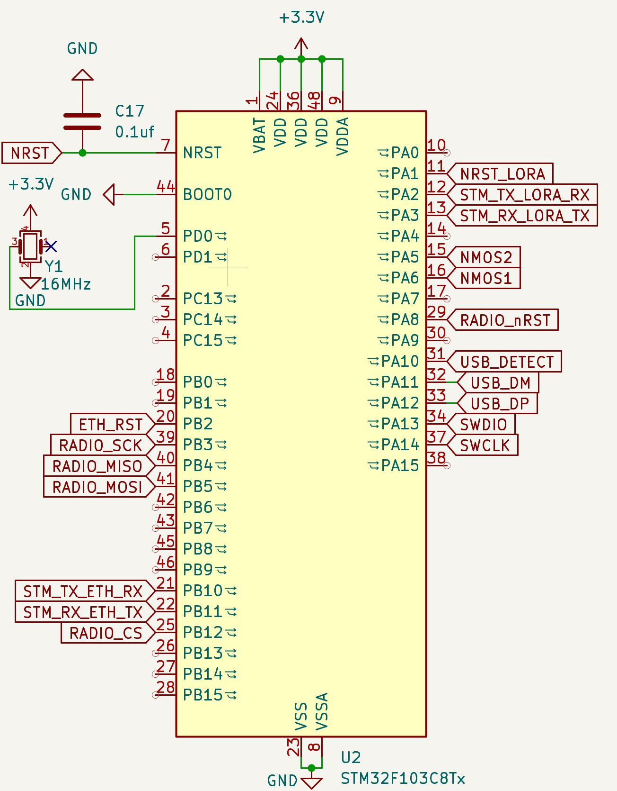
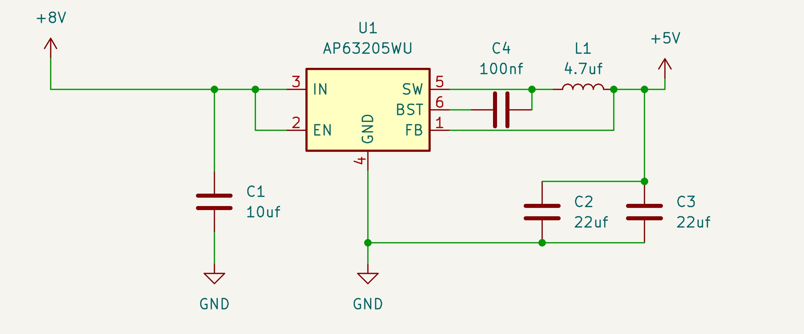
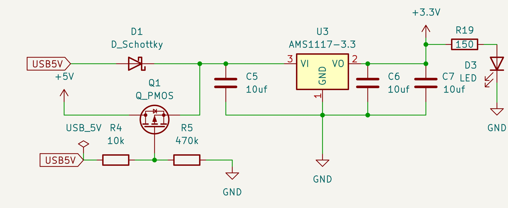
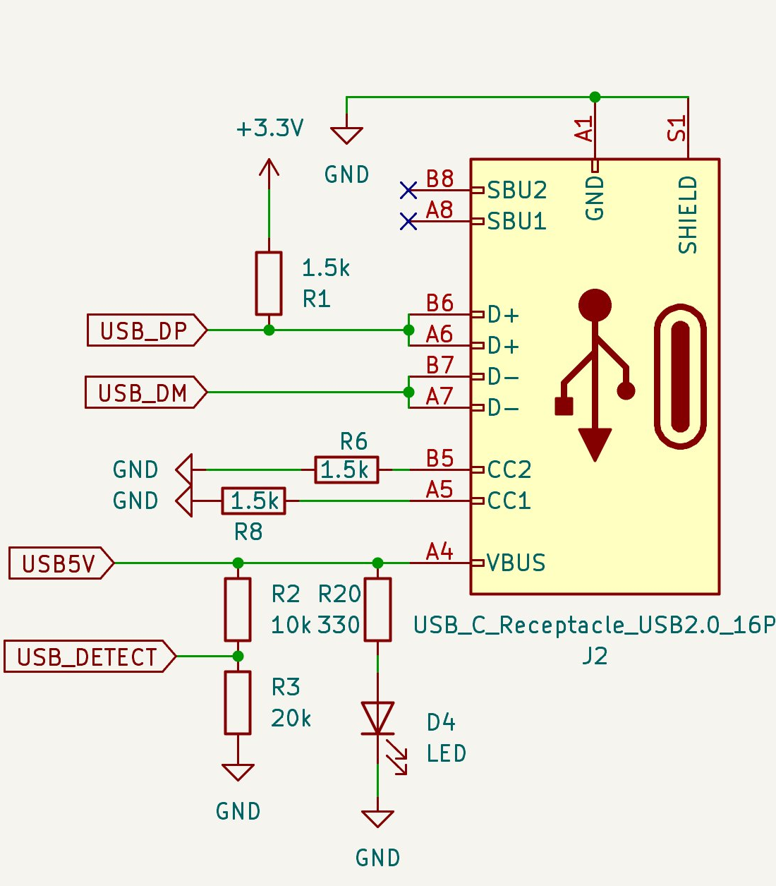
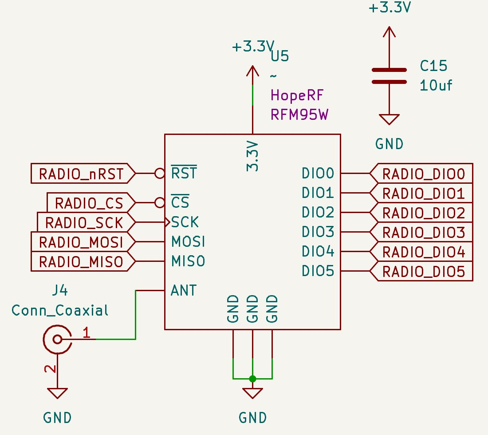
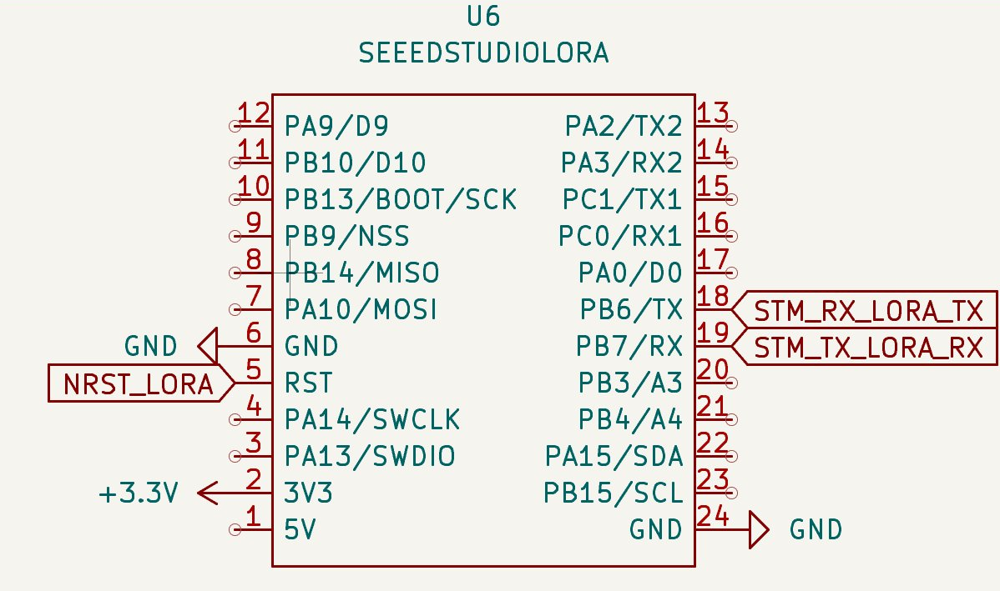
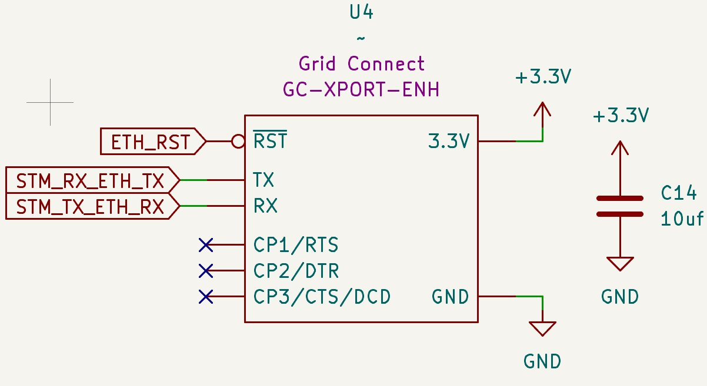
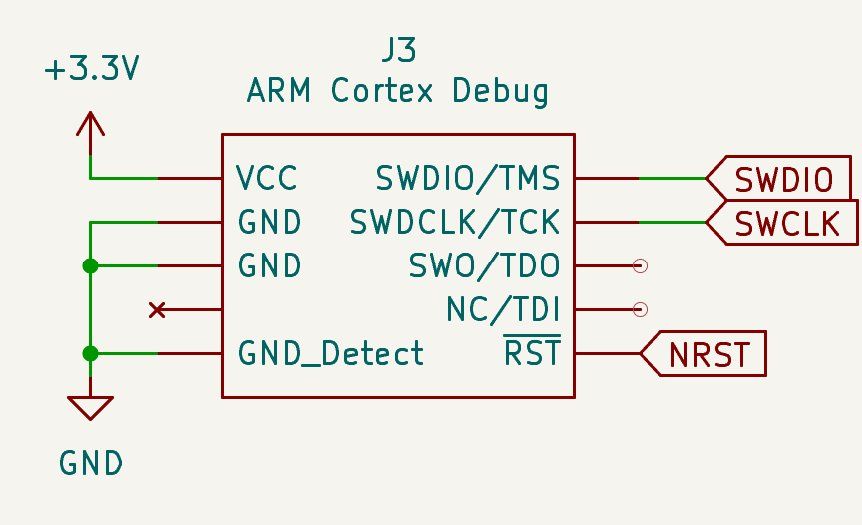

# TRS — Hardware

All three TRS units share the same `rocket2-trs-hardware` PCB. This page describes each circuit on the board — what it does, why it exists, and how its role differs across TRS-GND, TRS-ECU, and TRS-ARM.

---

## Microcontroller

The STM32 is the central processor of the board. It runs the radio state machine, handles arm/disarm logic, bridges serial data to Ethernet, and drives the FC switch — all from a single device.

| Unit | Role |
|------|------|
| TRS-GND | Manages both radio links, bridges data to Ethernet, monitors ECU battery |
| TRS-ECU | Receives ECU telemetry, bridges to Ethernet |
| TRS-ARM | Receives arm/disarm commands over radio, drives FC switch |

---

## Power Regulation

### 8V → 5V

The board takes an 8V input and steps it down to a 5V rail. A switching regulator is used here because the voltage drop is large enough that a linear regulator would waste significant power as heat — particularly during extended test campaigns.

### 5V → 3.3V

The 3.3V rail powers the MCU, both radios, and the Ethernet bridge. A PMOS power selector allows the board to run from either the main input or USB, with a Schottky diode preventing the two sources from conflicting. An LDO is used for the final regulation step because it produces a quieter output than a second switcher, which matters for the RF and ADC circuits.

| Unit | Power Source |
|------|-------------|
| TRS-GND | 5V USB-C |
| TRS-ECU | 8.4V power supply |
| TRS-ARM | 8.4V power supply |

---

## USB & Clock

USB-C is used for serial data output and debug only — it is not used for programming. A 16 MHz crystal oscillator provides the precise clock reference required for USB high-speed operation; the MCU's internal oscillator is not stable enough for this. A USB_DETECT signal tells the MCU when a host is connected.

| Unit | Notes |
|------|-------|
| TRS-GND | Active — used as power input and data output |
| TRS-ECU | Available for debug |
| TRS-ARM | Pre-flight only; must be disconnected before airframe close-out |

---

## Primary Radio — HopeRF RFM95W

The RFM95W provides the primary long-range radio link. LoRa modulation gives kilometre-scale range at low transmit power, which is critical for maintaining a link to the rocket at altitude or during parachute drift. It connects to the MCU over SPI and to an external coaxial antenna.

| Unit | Frequency | Purpose |
|------|-----------|---------|
| TRS-GND | 915 MHz | Arming link to TRS-ARM |
| TRS-ECU | 143 MHz | ECU telemetry receive |
| TRS-ARM | 915 MHz | Arming link from TRS-GND |

---

## Secondary Radio — Seeed Studio LoRa

A second independent radio module provides the 433 MHz link. Keeping it on a dedicated module means the two radio channels are electrically separate — REDS telemetry reception and arming commands cannot interfere with each other.

| Unit | Frequency | Purpose |
|------|-----------|---------|
| TRS-GND | 433 MHz | Receives REDS telemetry from the rocket |
| TRS-ECU |   N/A   | Populated but unused |
| TRS-ARM |   N/A   | Populated but unused |

---

## Ethernet Bridge

The Ethernet bridge converts UART serial data from the MCU into TCP/IP packets on the wired network. The MCU sends and receives plain bytes over UART — the bridge handles everything on the network side. This allows the GSE laptop and GUI PC to consume radio data over the LAN without any special drivers or direct serial connections. Level shifters sit between the bridge and the MCU to translate between their different logic voltages.

| Unit | Notes |
|------|-------|
| TRS-GND | Active — bridges both radio links to the test stand LAN |
| TRS-ECU | Active — bridges ECU telemetry to the bunker LAN |
| TRS-ARM | Not connected in flight |

---

## FC Switch

The FC switch gates power to the Easy Mini flight computer in response to arm/disarm commands. MOSFETs are used as the switching element because their near-zero on-resistance keeps the series resistance in the firing circuit low enough for the e-match to fire reliably — too much resistance and the e-match will not receive enough current. Optocouplers isolate the TRS ground from the Easy Mini ground so that transients on the firing side cannot couple back into the radio or MCU circuitry.

| Unit | Notes |
|------|-------|
| TRS-GND | Populated but inactive |
| TRS-ECU | Populated but inactive |
| TRS-ARM | **Active** — arms and disarms the Easy Mini flight computer |

---

## Battery Monitor

A resistor divider scales the 24V 6S LiPo ECU battery voltage down to a range the MCU ADC can read, with an LED providing a visual indicator of battery presence. This allows the board to track ECU battery state throughout the test campaign and flag any over-discharge condition.

| Unit | Notes |
|------|-------|
| TRS-GND | **Active** — monitors 24V ECU LiPo at the test stand |
| TRS-ECU | Not used |
| TRS-ARM | Not used |

---

## SWD Debug Header

The SWD header exposes SWDIO, SWCLK, and NRST for firmware flashing and live debugging via a probe such as ST-Link. It is not used during live operations.

| Unit | Notes |
|------|-------|
| TRS-GND | Available throughout operations |
| TRS-ECU | Available throughout operations |
| TRS-ARM | Pre-flight only; must be disconnected before airframe close-out |

