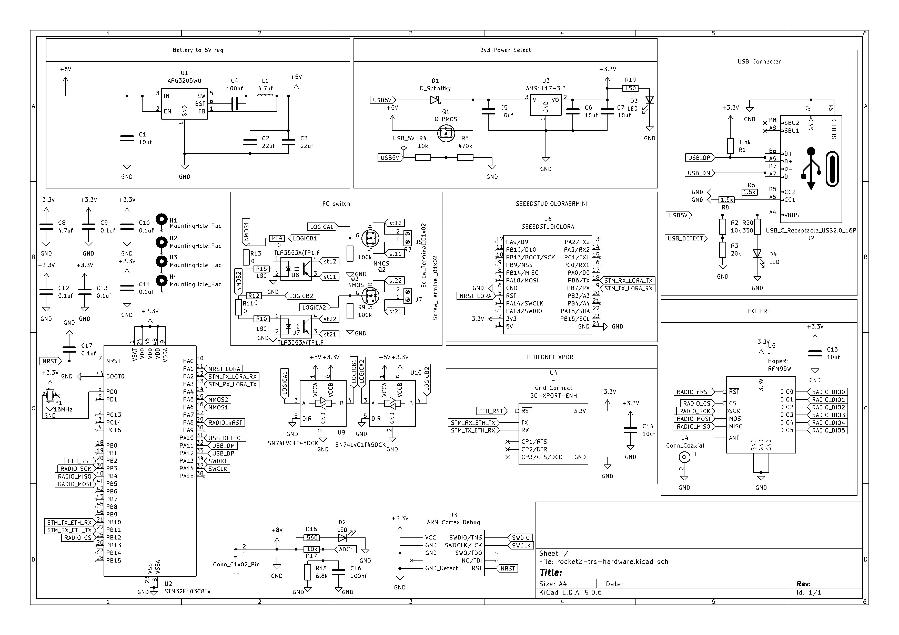

# TRS Documentation

Welcome to the **Telemetry Radio System (TRS)** documentation. This site covers all three TRS units used across the ground and rocket avionics systems.

---

The TRS family of boards receives radio telemetry, arms our flight computers, and provides command links between the rocket and the ground support equipment (GSE). All three units share the same PCB hardware but are configured differently based on their role in the system.

---

## Why Three TRS Units?

The system requires three physically separate TRS nodes because ECU, REDS, and TRS-ARM all need independent radio endpoints at different frequencies. We can't use 2 since TRS was designed with only two radio modules, thus justifying the need for a third one. 

**TRS-ARM** lives inside the rocket's avionics bay. It is the only way we can arm the Easy Mini flight computer remotely, as it will utilize the FC switch to turn it on. 

**TRS-GND** lives at the test stand. It handles the 915 MHz radio link to TRS-ARM and separately receives REDS radio data from the rocket on a 433 MHz frequency. It also manages the 24V 6S LiPo ECU battery. 

**TRS-ECU** lives in the bunker and receives live telemetry from the ECU over a 143 MHz frequency. As the two radio modules on TRS-GND are being utlized, we need a separate TRS to handle the ECU radio link.

Sharing one PCB across all three units reduces the number of unique designs to maintain, simplifies firmware development, and means any spare board can be re-flashed and dropped into any role.

---

## Units

| Unit | Location | Role |
|------|----------|------|
| [TRS-GND](trs-gnd/overview.md) | Test Stand | Remote arming for TRS-ARM, ECU battery management |
| [TRS-ECU](trs-ecu/overview.md) | Bunker | Receives live telemetry data from ECU |
| [TRS-ARM](trs-arm/overview.md) | Rocket AV Bay | Arms Easy Mini Flight Computer |

---

## Shared PCB

All three units use the same `rocket2-trs-hardware` PCB (KiCad E.D.A. 9.0.6).

<model-viewer
  src="assets/rocket2-trs-hardware.glb"
  alt="TRS Hardware PCB 3D Model"
  auto-rotate
  camera-controls
  shadow-intensity="1"
  style="width: 100%; height: 500px; background: #1a1a2e; border-radius: 8px; margin-bottom: 1.5rem;"
  exposure="1.2"
  environment-image="neutral">
</model-viewer>

> **Tip:** Click and drag to rotate · Scroll to zoom · Right-click drag to pan

---

## TRS Schematic

