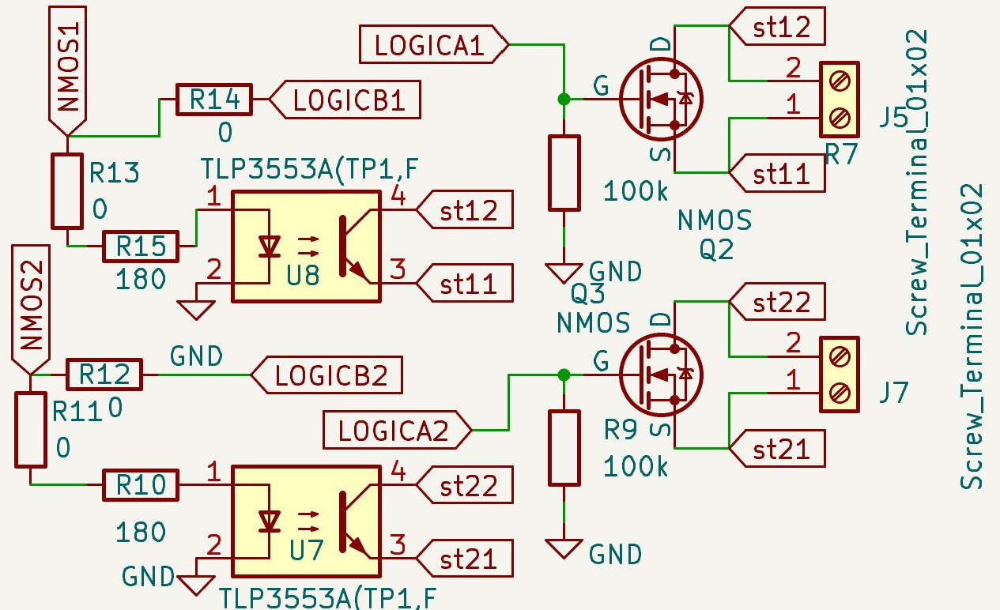

# TRS-ARM — Hardware

TRS-ARM uses the same `rocket2-trs-hardware` PCB as TRS-GND and TRS-ECU. See [Shared Hardware](../hardware.md) for a full explanation of every component and the reasoning behind each choice.

The critical difference in TRS-ARM  is that the **FC switch is actively used**. The TLP3553A optocouplers and NMOS transistors gate power to the Easy Mini flight computer in response to arm/disarm commands received over the radio link.

---

## FC Switch

---

## Why the FC Switch Is Designed the Way It Is

The Easy Mini and E-matches are sensitive to resistance in series with them. If the wire path from the flight computer to the e-match presents more than around one ohm of resistance, the e-match will not receive enough current to fire reliably. This is why MOSFETs are used as the switching element rather than a relay or a BJT — MOSFETs have an extremely low on-state resistance (R_DS(on)), which keeps the total series resistance in the firing circuit well below the threshold that would prevent ignition.

The logic level shifter is used to drive the MOSFET gates because the STM32 outputs 3.3V logic, and the MOSFETs require a gate voltage that fully saturates them into their low-resistance on-state. The level shifter steps the gate drive voltage up to ensure the MOSFET is driven hard enough that R_DS(on) is minimised — an under-driven gate leaves the MOSFET in a partially on state with significantly higher resistance, which defeats the purpose.

The TRS board and the Easy Mini have separate ground references. Without isolation, connecting them directly creates a transient path between the two grounds, which can cause unexpected current spikes and noise coupling between the arming circuit and the STM32 logic. The TLP3553A optocouplers break this ground loop by driving the MOSFET gates optically — the two ground domains never share a conductive path, so transients on the firing side cannot propagate back into the radio or STM32 circuitry.

## Enclosure / Mounting

TRS-ARM is mounted inside the rocket AV bay using the H1–H4 standoff holes. The coaxial antenna is routed along the airframe for the 915 MHz link. Ethernet is not connected in flight — the only external connections are power, the antenna, and the FC switch output to the Easy Mini. USB-C and SWD are accessible for pre-flight flashing and must be disconnected before airframe close-out.
