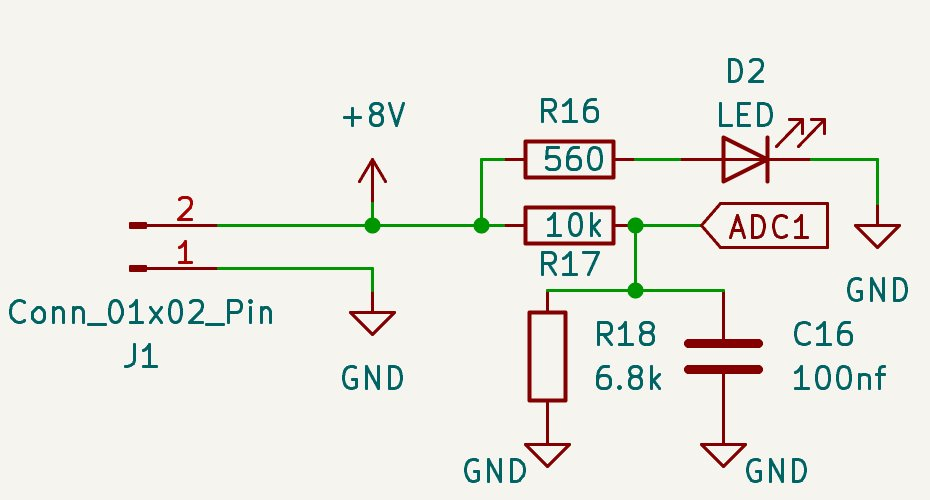

# TRS-GND — Hardware

TRS-GND uses the same `rocket2-trs-hardware` PCB as TRS-ECU and TRS-ARM. See [Shared Hardware](../hardware.md) for a full explanation of every component and the reasoning behind each choice.

The one meaningful difference in TRS-GND is that the **battery monitor circuit is actively used**. TRS-GND monitors the 24V 6S LiPo ECU battery at the test stand throughout the test campaign.

---

## Battery Monitor

A resistor divider scales the 24V 6S LiPo ECU battery voltage down to a range the STM32 ADC can read. An LED provides a visual indicator of battery presence. This allows TRS-GND to track ECU battery state throughout the test campaign and flag any over-discharge condition.

---

## Enclosure / Mounting

TRS-GND is mounted at the test stand. Ethernet connects directly to the network switch. Both radio antennas are routed externally — the 915 MHz coaxial for the arming link to TRS-ARM and the 433 MHz antenna for the REDS link from the rocket.
