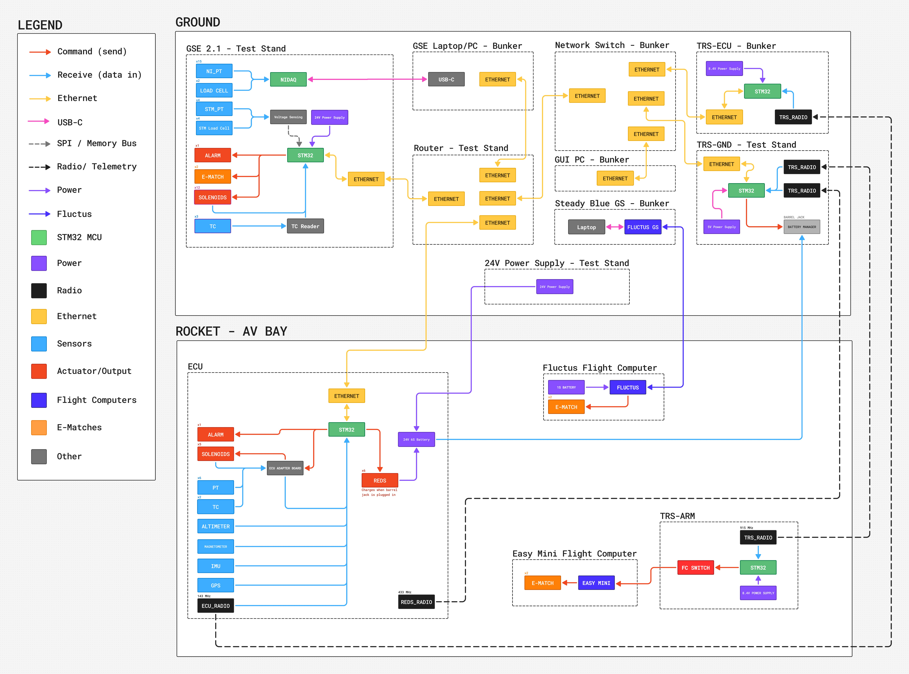

# TRS-ARM — Overview

**Location:** Rocket AV Bay  
**Role:** Rocket-side radio node, FC switch control, and arming relay

---

## PCB 3D Model

<model-viewer
  src="../assets/rocket2-trs-hardware.glb"
  alt="TRS Hardware PCB 3D Model"
  auto-rotate
  camera-controls
  shadow-intensity="1"
  style="width: 100%; height: 500px; background: #1a1a2e; border-radius: 8px; margin-bottom: 1.5rem;"
  exposure="1.2"
  environment-image="neutral">
</model-viewer>

> **Tip:** Click and drag to rotate · Scroll to zoom · Right-click drag to pan

---

## Description

TRS-ARM is mounted inside the rocket's avionics bay. It is the rocket-side endpoint of the 915 MHz LoRa telemetry link, communicating with TRS-GND at the test stand and TRS-ECU in the bunker. In addition to radio telemetry, TRS-ARM controls the **FC Switch** — the flight computer power/arming relay that gates the Easy Mini flight computer and associated e-match circuits.

TRS-ARM is powered by an 8.4V LiPo battery inside the AV bay.

---

## System Context

TRS-ARM sits in the **TRS-ARM** subsection of the Rocket AV Bay. It connects to:

- **TRS_RADIO (915 MHz)** → TRS-GND (Test Stand) and TRS-ECU (Bunker) via LoRa
- **FC Switch** → Controls Easy Mini flight computer power/arm signal
- **8.4V Power Supply** → Onboard LiPo in AV bay
- **Easy Mini** → Receives arm/disarm commands via FC Switch

---

## Key Responsibilities

- Receive commands from ground (arm, disarm, abort) over 915 MHz LoRa
- Transmit rocket telemetry back to ground
- Control FC Switch to arm/disarm the Easy Mini flight computer
- Operate reliably from battery power throughout flight
